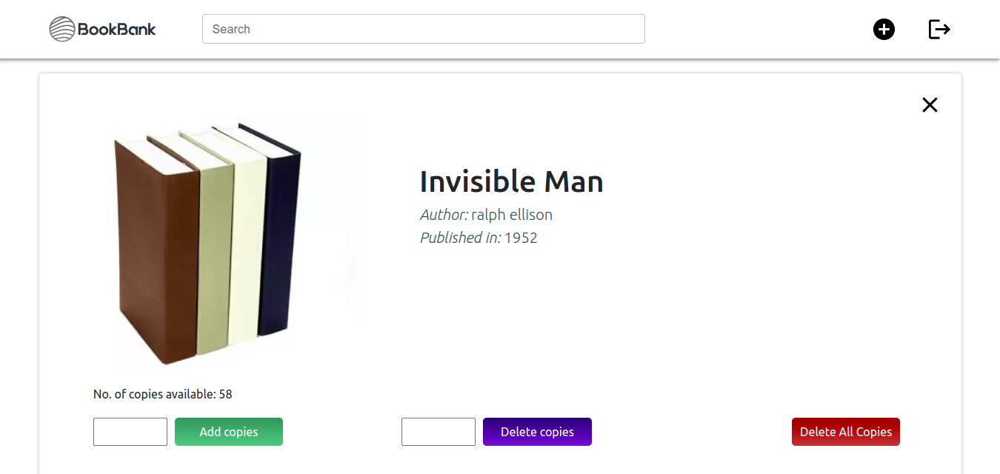

# BookBank

A MERN stack portal for Book Management, with user authentication, based on USER-ADMIN paradigm.

   

## Getting Started

1. Front-end part
- [Hosted application](https://bookbank-frontend.vercel.app/)
- Fork repo and run `git clone <forked repo>` command from your terminal/bash.
- Cd into the cloned repo and run `npm install`.
- Change `url_path` in case you are runnig server in local host.
- Run application with `npm start` command.

2. Back-end part
- [Back-end API](https://gentle-forest-68636.herokuapp.com/api/)
-  Fork this repo and run the `git clone <forked repo>` command from your terminal/bash.
-   Cd into the directories and `npm install`.
-   Create a `.env` file in the root directory and store the following:
    -   MONGO_URI=Insert the correct connection URL for your MongoDB database
-   Run the server, by running `npm start`

You can obtain the MONGO_URI after create a collection on [mongodb atlas](https://www.mongodb.com/cloud/atlas).

## Demo

Backend API has been hosted on heroku [here](https://mern-blog-it.herokuapp.com/) and The frontend is hosted on [Netlify](frontend-link). P.S: You might have to wait for a few seconds for the heroku site to respond.

 
 
 
  
  
  
  

## Info

-   This is a book management portal with user authentication and authorization.
-   The frontend of the app is built using React and I have used Bootstrap classes for styling the compnents in addition to my local CSS styles.
-   It is a book management app that lets users (students) to issue a book, and can return it too and also can search about books with year of publication, name, author name.
-   A user is able to see a feed with all available book.
-   It has some ADMIN operations as well which includes, adjustment of number of copies of a particular book, adding a book.
-   It has been deployed using Heroku's free tier and the Mongodb Atlas's cloud service is used for the database service.
-   You can check out the app [here](https://mern-blog-it.herokuapp.com/) or by using the link in the description section

## Potential Improvements

-   A UX refactor.
-   Dashboard implementation for all registered users.
-   More social login options including the likes of Github, Facebook, Amazon or Apple.
-   Fuzzy Search implementation.
-   Adding more user realted fields
-   adding Thumbnails for books

Any more suggestions are always welcome in the PRs!

## Technologies Used

Some of the technologies used in the development of this web application are as follow:

-   [MongoDB Atlas](https://www.mongodb.com/cloud/atlas): It provides a free cloud service to store MongoDB collections.
-   [React.js](https://reactjs.org/): A JavaScript library for building user interfaces.
-   [Node.js](https://nodejs.org/en/): A runtime environment to help build fast server applications using JS.
-   [Express.js](https://expressjs.com/): A popular Node.js framework to build scalable server-side for web applications.
-   [Mongoose](https://mongoosejs.com/): An ODM(Object Data Modelling)library for MongoDB and Node.js
-   [Heroku](http://heroku.com/): A platform(PaaS) to deploy full stack web applications for free.
-   [JSON Web Tokens or JWTs](https://jwt.io/): A standard to securely authenticate HTTP requests